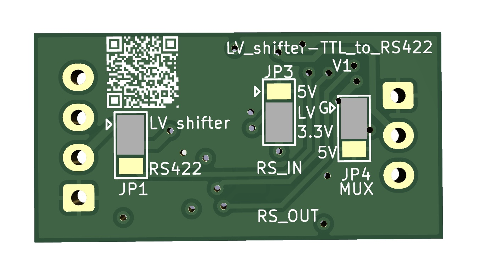
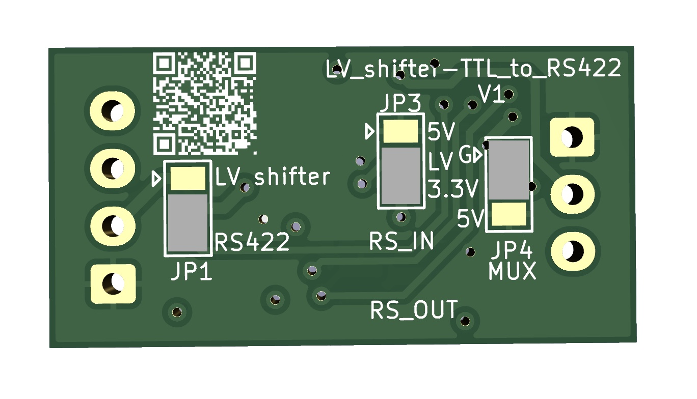
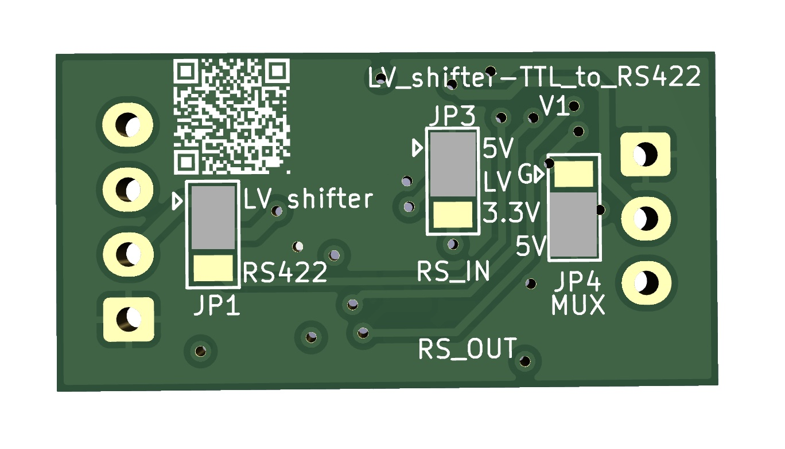

# LV_shifter-TTL_to_RS422

Top view: 
 
Bottom view: 
 
## Configuration

### Simple 3.3V to 5V Levelshifter:

### Digital LED over long cable with RS422:
Sender: From ESP (3.3V pin) -> Levelshift to 5V -> Translate to RS422 -> send out. 
Receiver: receive RS422 -> translate back -> control 5V digital LED.

Sender solder config       |  Receiver solder config
:-------------------------:|:-------------------------:
   |  

